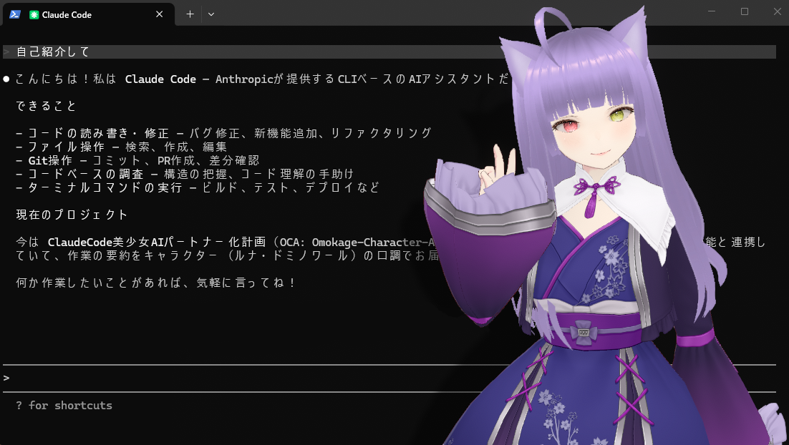

# Omokage-Character-Agent (OCA)

[VMagicMirror](https://baku-dreameater.booth.pm/items/1272298) で表示した VRM アバターと、[VOICEVOX](https://voicevox.hiroshiba.jp/) の音声合成を Claude Code の応答に連動させる Windows 向け連携ツールです。

## できること

- Claude Code が自身の応答を要約し、**VOICEVOX に音声合成を依頼**して読み上げる
- 応答内容に応じて **VMagicMirror の表情・動きを自動で切り替え**る（喜び・怒り・悲しみ等 10 種類）
- [VB-Cable](https://vb-audio.com/Cable/) を経由して音声を VMagicMirror に送り、**リップシンク（口パク）を連動**させる

## 必要なもの

| ソフトウェア | 用途 |
| --- | --- |
| Python 3.10+ | スクリプト実行 |
| VMagicMirror | VRM アバター表示 |
| VOICEVOX | 音声合成 |
| VB-CABLE（任意） | リップシンク連動 |
| Claude Code | AI アシスタント |

> 上記のソフトウェアは本ツールに同梱されておらず、それぞれ独立したプロジェクトです。各ソフトウェアのライセンス・利用規約に従ってご利用ください。

## セットアップ

**詳しい手順は [はじめに_初回セットアップ手順.md](はじめに_初回セットアップ手順.md) をご覧ください。**

1. **`初回セットアップ.bat`** をダブルクリック
2. **`設定画面を開く.bat`** をダブルクリックして初期設定

## ドキュメント

| ファイル | 内容 |
| --- | --- |
| [はじめに_初回セットアップ手順.md](はじめに_初回セットアップ手順.md) | 初心者向けセットアップガイド |
| [MANUAL.md](src/MANUAL.md) | 詳細マニュアル |

## ライセンス

本ツールは [MIT License](LICENSE) で公開しています。自由に使用・改変・再配布できます。

## 外部ソフトウェアの利用規約について

本ツールは以下の外部ソフトウェアと連携して動作しますが、いずれも本ツールとは無関係の独立したプロジェクトです。ご利用の際は各ソフトウェアのライセンス・利用規約をご確認ください。

- **[VOICEVOX](https://voicevox.hiroshiba.jp/)** — 生成された音声の利用にあたっては、キャラクターごとの利用規約に従ってください（クレジット表記が必要な場合があります）
- **[VMagicMirror](https://baku-dreameater.booth.pm/items/1272298)** — VRM アバターの表示・モーション・表情制御・リップシンクに利用しています
- **[VB-Cable](https://vb-audio.com/Cable/)** — 仮想オーディオデバイスとしてリップシンク連動に利用しています
- **[Claude Code](https://claude.com/claude-code)** — Anthropic 社の AI コーディングアシスタントです
- **[Python](https://www.python.org/)** — スクリプトの実行環境として利用しています
